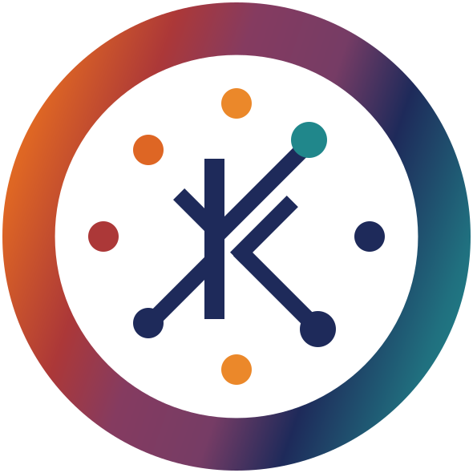

# Koheesio

<div align="center">



| | |
| --- | --- |
| Meta |  [](https://github.com/astral-sh/ruff)  [](https://github.com/psf/black) |

</div>

-----

A framework that can be used to build advanced data-pipelines by simple Python implementations

## Introduction

Koheesio is aimed at those building data processing pipelines in Python, particularly useful for large-scale data.

Koheesio, named after the Finnish word for cohesion, is a Python framework for building type-safe and efficient Data
Pipelines. It promotes modularity, composability, and collaboration, allowing for the creation of complex pipelines
from simple, reusable components.

Koheesio's goal is to ensure predictable pipeline execution through a solid foundation of well-tested code and a rich
set of features, making it an excellent choice for developers and organizations seeking to build robust and adaptable
Data Pipelines.

- It is designed to be modular and composable, allowing for the creation of complex pipelines from simple components.  
- It is designed to promote collaboration among developers and engineers and encourages the use of reusable components.  

Leveraging [PySpark], a Python library for Apache Spark, Koheesio efficiently handles large-scale data processing tasks.

Additionally, Koheesio also uses [Pydantic] for strong typing, data validation, and settings management, ensuring a high level of type safety and structured configurations within pipeline components.

  [Pydantic]: docs/includes/glossary.md#pydantic
  [Pyspark]: docs/includes/glossary.md#pyspark

??? question "What sets Koheesio apart from other libraries?"

    Koheesio encapsulates years of data engineering expertise, fostering a collaborative and innovative community. While 
    similar libraries exist, Koheesio's focus on data pipelines, integration with PySpark, and specific design for tasks 
    like data transformation, ETL jobs, data validation, and large-scale data processing sets it apart.
  
    Koheesio aims to provide a rich set of features including readers, writers, and transformations for any type of Data
    processing. Koheesio is not in competition with other libraries. Its aim is to offer wide-ranging support and focus on utility in a multitude of scenarios. Our preference is for integration, not competition...
  
    We invite contributions from all, promoting collaboration and innovation in the data engineering community.

    **Comparison with Other Libraries**

    Koheesio is a unique Python framework for building data pipelines. While there are several other libraries and tools 
    for building pipelines in Python, they differ in their approach and focus.

    Here's a brief comparison of Koheesio with other libraries:

    - [Luigi](https://github.com/spotify/luigi): Developed at Spotify, Luigi is a tool for building complex pipelines of 
    batch jobs. It handles dependency resolution, workflow management, visualization, error handling, and retries. However,
    it's not specifically designed for data pipelines.

    - [Airflow](https://github.com/apache/airflow): Apache Airflow, developed at Airbnb, is a tool for authoring, 
    scheduling, and monitoring workflows. It supports workflows as code, version control, code review, and standard 
    software development practices. Like Luigi, it's not specifically designed for data pipelines and instead focuses more 
    on pipeline orchestration.

    - [Prefect](https://github.com/PrefectHQ/prefect): Prefect is a workflow management system that handles various tasks, 
    including data processing. It has features for handling failures and retries. However, unlike Koheesio, it's not 
    specifically designed for data pipelines and doesn't integrate with PySpark or use Pydantic for strong typing.

    - [Dask](https://github.com/dask/dask): Dask provides advanced parallelism for analytics. It simplifies the process of 
    building and executing data pipelines, but approaches the problem differently from Koheesio. Dask has its own methods 
    for parallel and distributed computing.

    - [Kedro](https://github.com/quantumblacklabs/kedro): Kedro applies software engineering best-practice to data and 
    machine-learning pipelines. It simplifies the process of building and executing data pipelines, but approaches the 
    problem differently from Dask and Koheesio.

    - [dbt](https://github.com/fishtown-analytics/dbt): dbt is a standalone tool for data modeling and transformation. It a
    llows for the definition, documentation, and testing of complex SQL transformations. Unlike Koheesio, dbt focuses on 
    transforming data within your data warehouse using SQL.

## Koheesio Core Components

Here are the key components included in Koheesio:

- __Step__: This is the fundamental unit of work in Koheesio. It represents a single operation in a data pipeline,
  taking in inputs and producing outputs.
- __Task__: This is a larger unit of work, typically encompassing an entire Extract - Transform - Load process for a
  data object.
- __Context__: This is a configuration class used to set up the environment for a Task. It can be used to share
  variables across tasks and adapt the behavior of a Task based on its environment.
- __Logger__: This is a class for logging messages at different levels.
- __Reader__: This is a type of Step that reads data from a source and stores the result (to make it available for
  subsequent steps)
- __Writer__: This controls how data is written to the output in both batch and streaming contexts.
- __Transformation__: This is a type of Step that takes a DataFrame as input and returns a DataFrame as output.

```text
┌─────────┐        ┌──────────────────┐        ┌─────────┐
│ Input 1 │───────▶│                  ├───────▶│Output 1 │
└─────────┘        │                  │        └─────────┘
                   │                  │
┌─────────┐        │                  │        ┌─────────┐
│ Input 2 │───────▶│       Step       │───────▶│Output 2 │
└─────────┘        │                  │        └─────────┘
                   │                  │
┌─────────┐        │                  │        ┌─────────┐
│ Input 3 │───────▶│                  ├───────▶│Output 3 │
└─────────┘        └──────────────────┘        └─────────┘
```

The interactions between the base concepts of the model is visible in the below diagram: 

Below sections provide some more details on every Core Component

### Step

The Step is the fundamental unit of work in Koheesio. It represents a single operation in a data pipeline, taking in
inputs and producing outputs.  

For example, a Step could be a process that takes in raw data, cleans it, and outputs the cleaned data. Each Step is
designed to be self-contained and reusable, meaning it can be used in multiple tasks or pipelines without modification.

### Task

A Task in Koheesio is a larger unit of work, typically encompassing an entire Extract - Transform - Load (ETL) process
for a data object.  

For example, a Task could involve extracting data from a database, transforming the data using several Steps, and then
loading the transformed data into a data warehouse. Tasks are designed to be modular and composable, allowing developers
to build complex data pipelines by combining multiple Tasks.

Task is a subclass of Step.

### Context

The Context in Koheesio is a configuration class/interface used to set up the environment for a Task. It can be used to
share variables across tasks and adapt the behavior of a Task based on its environment.  

For example, a Context could be used to specify the database connection details for a Task, or to specify the output
format for a Writer. The Context is designed to be flexible and adaptable, allowing developers to easily configure their
tasks to suit different environments or requirements. Note that the use of Context is not bound to Tasks; Task is used
illustratively in this description.

Context can be created from yaml files, dictionaries, or json files. It also possible to merge multiple Contexts
together. Koheesio also has the notion of a 'SecretContext', which can be used to store sensitive information such as
passwords or API keys without exposing them in the code.

### Logger

The Logger in Koheesio is a class/interface for logging messages at different levels. It can be used to log debug
messages, informational messages, warnings, errors, and critical errors.  

For example, a Logger could be used to log the progress of a Task, or to log any errors that occur during the execution
of a Task. The Logger is designed to be easy to use and flexible, allowing developers to easily monitor the progress and
status of their tasks.
The API of logger is designed to mimic that of those found in Scala.  
Click [here](docs/concepts/logging.md) to see logger examples.

### Reader

The Reader in Koheesio is a type of Step that reads data from a source and stores the result. For example, a Reader
could be used to read data from a CSV file, a database, or an API. The Reader is designed to be flexible and adaptable,
allowing developers to easily read data from a wide range of sources.

Reader is a subclass of Step

### Writer

The Writer in Koheesio controls how data is written to the output in both batch and streaming contexts. For example, a
Writer could be used to write data to a CSV file, a database, or an API. The Writer is designed to be flexible and
adaptable, allowing developers to easily write data to a wide range of destinations.

Writer is a subclass of Step.

### Transformation

The Transformation in Koheesio is a type of Step that takes a DataFrame as input and returns a DataFrame as output. For
example, a Transformation could be used to clean data, aggregate data, or perform complex calculations on data. The
Transformation is designed to be flexible and powerful, allowing developers to easily perform a wide range of data
transformations.

Transformation is a subclass of Step.

## Installation

You can install Koheesio using either pip or poetry.

### Using Pip

To install Koheesio using pip, run the following command in your terminal:

```bash
pip install koheesio
```

### Using Poetry

If you're using poetry for package management, you can add Koheesio to your project with the following command:

```bash
poetry add koheesio
```

or add the following line to your `pyproject.toml` (under `[tool.poetry.dependencies]`), making sure to replace
`...` with the version you want to have installed:

```toml
koheesio = {version = "..."}
```

### Extras

Koheesio also provides some additional features that can be useful in certain scenarios. These include:

- __Spark Expectations:__  Available through the `koheesio.steps.integration.dq` module; installable through the `se` extra.
  - SE Provides Data Quality checks for Spark DataFrames.
  - For more information, refer to the [Spark Expectations docs](https://engineering.nike.com/spark-expectations).

[//]: # (- **Brickflow:** Available through the `koheesio.steps.integration.workflow` module; installable through the `bf` extra.)
[//]: # (    - Brickflow is a workflow orchestration tool that allows you to define and execute workflows in a declarative way.)
[//]: # (    - For more information, refer to the [Brickflow docs]&#40;https://engineering.nike.com/brickflow&#41;)

- __Box__: Available through the `koheesio.steps.integration.box` module; installable through the `box` extra.
  - Box is a cloud content management and file sharing service for businesses.

- __Cerberus__: Available through the `koheesio.steps.integration.secrets` module; installable through the `cerberus` extra.
  - Cerberus is a tool for managing secrets in a secure and scalable way.
  - For more information, refer to the [Cerberus docs](https://engineering.nike.com/cerberus)

> __Note:__  
> Some of the steps require extra dependencies. See the [Extras](#extras) section for additional info.  
> Extras can be added to Poetry by adding `extras=['name_of_the_extra']` to the toml entry mentioned above

## Getting Started

In this section, we will provide an example of how you can use Koheesio. This example uses all the Core Concepts
(except an explicit logger) to show how it can be combined end-to-end.

Consider this code snippet:

```python
from pyspark.sql.functions import lit
from pyspark.sql import DataFrame, SparkSession

# Step 1: import Koheesio dependencies
from koheesio.context import Context
from koheesio.steps.readers.dummy import DummyReader
from koheesio.steps.transformations.camel_to_snake import CamelToSnakeTransformation
from koheesio.steps.writers.dummy import DummyWriter
from koheesio.tasks.etl_task import EtlTask

# Step 2: Set up a SparkSession
spark = SparkSession.builder.getOrCreate()

# Step 3: Configure your Context
context = Context({
    "source": DummyReader(),
    "transformations": [CamelToSnakeTransformation()],
    "target": DummyWriter(),
    "my_favorite_movie": "inception",
})

# Step 4: Create a Task
class MyFavoriteMovieTask(EtlTask):
    my_favorite_movie: str

    def transform(self, df: DataFrame = None) -> DataFrame:
        df = df.withColumn("MyFavoriteMovie", lit(self.my_favorite_movie))
        return super().transform(df)

# Step 5: Run your Task
task = MyFavoriteMovieTask(**context)
task.run()
```

??? info "Explaining the code above in detail"

    1. **Installation**: Refer to the [Installation](#installation) section for instructions on how to install Koheesio. Once that is done, you can import koheesio dependencies into your scripts.

    2. **Set up a SparkSession**: Koheesio expects a SparkSession to already exist. Here, we are using the `builder.getOrCreate` method to create a SparkSession. For more information, refer to the [Spark documentation](https://spark.apache.org/docs/latest/api/python/pyspark.sql.html#pyspark.sql.SparkSession).

    3. **Configure your Context**:  
       
        Set up your `Context` to configure the environment for your `Task`. This can include variables shared across tasks and environment-specific settings. 

        In this example, the `Context` is set up with a `DummyReader`, a `CamelToSnakeTransformation`, and a `DummyWriter`. 

        - The `DummyReader` and `DummyWriter` are simple implementations of a reader and writer that can be used for testing or debugging. 
        - The `CamelToSnakeTransformation` is a transformation (meaning: a subclass of the `Transformation` class) that converts column names from camel case to snake case.
        - Additionally, a favorite movie "inception" is set in the context.

        > **Note**: 
        >
        > - `DummyReader` is a simple reader that returns a DataFrame with an id-column of the given range. It can be used in place of any Reader without having to read from a real source. The output DataFrame will have a single column named "id" of type Long and length of the given range.
        > - `DummyWriter` performs a `df.show()` on the given DataFrame and returns the first row of data as a dict. It does not actually write anything to a source/destination, but is useful for debugging or testing purposes.
        > - `CamelToSnakeTransformation` converts column names from camel case to snake case. If no columns are specified, all columns will be converted. The data in the columns is not changed, only the column names.

    4. **Create a Task**:

        Start by creating a `Task`. This is a unit of work that typically follows an Extract - Transform - Load approach for a data object. You can extend the `EtlTask` class to create your own custom tasks. In this example, a custom task called `MyFavoriteMovieTask` is created by extending the `EtlTask` class from Koheesio. This task has a single attribute, `my_favorite_movie`, and a `transform` method. The `transform` method adds a new column "MyFavoriteMovie" to the input DataFrame, filled with the value of `my_favorite_movie`. It then calls the transform method of the superclass `EtlTask` to apply any additional transformations defined there (in case of this example, this is the `CamelToSnakeTransformation`).

        > **Note**:
        >
        > Transformations in the `EtlTask` can be chained together. The DataFrame output of one transformation will be passed on as input to the next transformation in the list. This allows for a sequence of transformations to be applied to the data.

    5. **Run your Task**:
     
        Once your `Task` is set up and your `Context` is configured, you can run your `Task`. In this example, an instance of `MyFavoriteMovieTask` is created with the values from `context` as arguments, and the task is run. This demonstrates how to run a custom task in Koheesio.
      
        > **Note**: instead of `.run`, you could also use `.execute`.

    Remember, you can create custom implementations of `Steps`, `Readers`, `Writers`, and `Transformations` to suit your specific needs. Just ensure they match the API of the component they're replacing.
    
    For more detailed instructions and examples, check out the [Koheesio documentation](#).

Based on the `DummyReader()`, we start with an input DataFrame that looks like this:

|  id |
| --- |
|   1 |
| ... |
| 100 |

The transform method we specified in our custom Task adds a new column called "MyFavoriteMovie" to the input DataFrame, filled with the value of `my_favorite_movie` that we provided while initializing the class.

Given that the `CamelToSnakeTransformation` changes the column names into snake case, the output DataFrame from `task.run()` will have two columns: 'id' and 'my_favorite_movie'. The 'id' column will contain 100 rows of data (as provided by DummyReader), and the 'my_favorite_movie' column will contain the same value "inception" for all rows.

The DummyWriter then performs a df.show() on the DataFrame and returns the first row of data as a dict. So, the final output of task.run() would be a dictionary representing the first row of the DataFrame, something like this:

```python
{'id': 0, 'my_favorite_movie': 'inception'}
```

The DataFrame is available as an attribute of the Task, so you can also access it directly using `task.output.target_df`.

The data in this DataFrame looks like this:

|  id | my_favorite_movie |
|----:|------------------:|
|   0 |         inception |
| ... |               ... |
| 100 |         inception |

## Custom Implementations

In Koheesio, custom implementations can replace the provided implementations as long as they match the API. Here are
some examples:

1. __Custom Step__: You can create a custom Step that performs a specific operation not covered by the built-in Steps.
    For example, you might create a Step that performs a specific type of data validation or a complex transformation.

    ```python
    class CustomStep(Step):
        def execute(self):
            # Implement your custom logic here
    ```

2. __Custom Reader__: You can create a custom Reader that reads data from a specific source not covered by the built-in
    Readers. For example, you might create a Reader that reads data from a proprietary database or a specific API.

    ```python
    class CustomReader(Reader):
        def execute(self):
            # Implement your custom logic here
    ```

3. __Custom Writer__: You can create a custom Writer that writes data to a specific destination not covered by the
    built-in Writers. For example, you might create a Writer that writes data to a proprietary database or a specific
    API.

    ```python
    class CustomWriter(Writer):
        def execute(self):
            # Implement your custom logic here
    ```

4. __Custom Transformation__: You can create a custom Transformation that performs a specific transformation not
   covered by the built-in Transformations. For example, you might create a Transformation that performs a complex
   calculation or a specific type of data cleaning.

    ```python
    class CustomTransformation(Transformation):
        def execute(self):
            # Implement your custom logic here
    ```

Note that in all the above examples, the `execute` method is the only method that needs to be implemented. This is
per design.

Remember, the key to creating custom implementations in Koheesio is to ensure they match the API of the component
they're replacing. This ensures they can be used interchangeably with the built-in components. Check out the API
Documentation for more details on the many different components available in Koheesio.

Before creating custom implementations, it's a good idea to check if there's already a built-in component that can be
used instead. This will save you time and effort in the long run. When you do create custom implementations, read
through the API documentation belonging to the Step and StepOutput modules.

## Contributing

### How to Contribute

We welcome contributions to our project! Here's a brief overview of our development process:

- __Code Standards__: We use `pylint`, `black`, and `mypy` to maintain code standards. Please ensure your code passes
  these checks by running `make check`. No errors or warnings should be reported by the linter before you submit a pull
  request.

- __Testing__: We use `pytest` for testing. Run the tests with `make test` and ensure all tests pass before submitting
  a pull request.

- __Release Process__: We aim for frequent releases. Typically when we have a new feature or bugfix, a developer with
  admin rights will create a new release on GitHub and publish the new version to PyPI.

For more detailed information, please refer to our [contribution guidelines](./docs/contribute.md). We also adhere to
[Nike's Code of Conduct](https://github.com/Nike-Inc/nike-inc.github.io/blob/master/CONDUCT.md) and [Nike's Individual Contributor License Agreement](https://www.clahub.com/agreements/Nike-Inc/fastbreak).

### Additional Resources

- [General GitHub documentation](https://help.github.com/)
- [GitHub pull request documentation](https://help.github.com/send-pull-requests/)
- [Nike OSS](https://nike-inc.github.io/)
