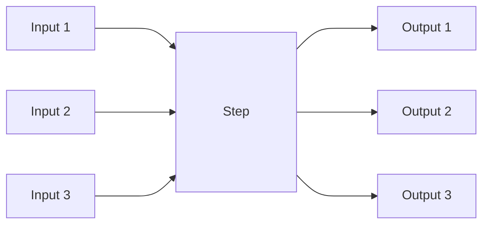
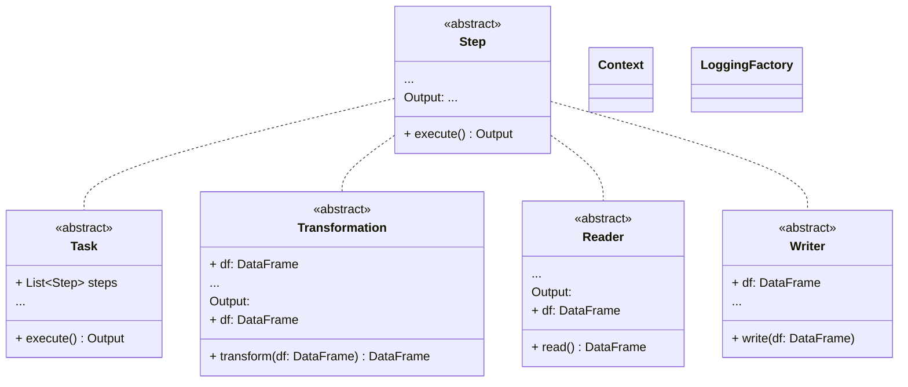

The framework architecture is built from a set of core components. Each of the implementations that the framework 
provides out of the box, can be swapped out for custom implementations as long as they match the API.

The core components are the following:
> <small>*Note:* click on the 'Concept' to take you to the corresponding module. The module documentation will have 
  greater detail on the specifics of the implementation</small>

[//]: # (References)
[Context]: context.md
[Logging]: logger.md
[Step]: step.md

## [Step]

A custom unit of logic that can be executed. A Step is an atomic operation and serves as the building block of data 
pipelines built with the framework. A step can be seen as an operation on a set of inputs, and returns a set of 
outputs. This does not imply that steps are stateless (e.g. data writes)! This concept is visualized in the figure 
below.

Step is the core abstraction of the framework. Meaning, that it is the core building block of the framework and is used
to define all the operations that can be executed. 

Please see the [Step] documentation for more details.

## [Context]

The Context is used to configure the environment where a Task or Step runs.

It is often based on configuration files and can be used to adapt behaviour of a Task or Step based on the environment
it runs in.

Please see the [Context] documentation for more details.

## [Logging]

A logger object to log messages with different levels.

Please see the [Logging] documentation for more details.

The interactions between the base concepts of the model is visible in the below diagram:  

