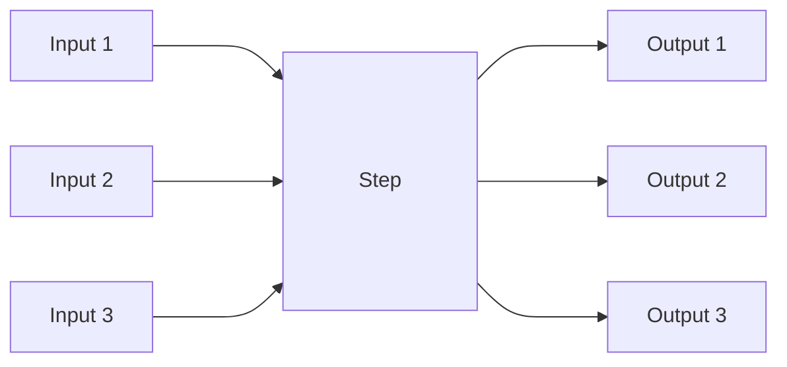

# Steps in Koheesio

In the Koheesio framework, the `Step` class and its derivatives play a crucial role. They serve as the building blocks 
for creating data pipelines, allowing you to define custom units of logic that can be executed. This document will 
guide you through its key features and show you how to leverage its capabilities in your Koheesio applications.

Several type of Steps are available in Koheesio, including `Reader`, `Transformation`, `Writer`, and `Task`.


## What is a Step?

A `Step` is an atomic operation serving as the building block of data pipelines built with the Koheesio framework. 
Tasks typically consist of a series of Steps. 

A step can be seen as an operation on a set of inputs, that returns a set of outputs. This does not imply that steps 
are stateless (e.g. data writes)! This concept is visualized in the figure below.



## How to Read a Step?

A `Step` in Koheesio is a class that represents a unit of work in a data pipeline. It's similar to a Python built-in 
data class, but with additional features for execution, validation, and logging.

When you look at a `Step`, you'll typically see the following components:

1. **Class Definition**: The `Step` is defined as a class that inherits from the base `Step` class in Koheesio. 
    For example, `class MyStep(Step):`.

2. **Input Fields**: These are defined as class attributes with type annotations, similar to attributes in a Python 
    data class. These fields represent the inputs to the `Step`. For example, `a: str` defines an input field `a` of 
    type `str`. Additionally, you will often see these fields defined using Pydantic's `Field` class, which allows
    for more detailed validation and documentation as well as default values and aliasing.

3. **Output Fields**: These are defined in a nested class called `Output` that inherits from `StepOutput`. This class 
    represents the output of the `Step`. For example, `class Output(StepOutput): b: str` defines an output field `b` of 
    type `str`.

4. **Execute Method**: This is a method that you need to implement when you create a new `Step`. It contains the logic 
    of the `Step` and is where you use the input fields and populate the output fields. For example, 
    `def execute(self): self.output.b = f"{self.a}-some-suffix"`.

Here's an example of a `Step`:

```python
class MyStep(Step):
    a: str  # input

    class Output(StepOutput):  # output
        b: str

    def execute(self) -> MyStep.Output:
        self.output.b = f"{self.a}-some-suffix"
```

In this `Step`, `a` is an input field of type `str`, `b` is an output field of type `str`, and the `execute` method
appends `-some-suffix` to the input `a` and assigns it to the output `b`.

When you see a `Step`, you can think of it as a function where the class attributes are the inputs, the `Output` class 
defines the outputs, and the `execute` method is the function body. The main difference is that a `Step` also includes 
automatic validation of inputs and outputs (thanks to Pydantic), logging, and error handling.


## Understanding Inheritance in Steps

Inheritance is a core concept in object-oriented programming where a class (child or subclass) inherits properties and 
methods from another class (parent or superclass). In the context of Koheesio, when you create a new `Step`, you're 
creating a subclass that inherits from the base `Step` class.

When a new Step is defined (like `class MyStep(Step):`), it inherits all the properties and methods from the `Step` 
class. This includes the `execute` method, which is then overridden to provide the specific functionality for that Step.

Here's a simple breakdown:

1. **Parent Class (Superclass)**: This is the `Step` class in Koheesio. It provides the basic structure and 
    functionalities of a Step, including input and output validation, logging, and error handling.

2. **Child Class (Subclass)**: This is the new Step you define, like `MyStep`. It inherits all the properties and 
    methods from the `Step` class and can add or override them as needed.

3. **Inheritance**: This is the process where `MyStep` inherits the properties and methods from the `Step` class. In 
    Python, this is done by mentioning the parent class in parentheses when defining the child class, like 
    `class MyStep(Step):`.

4. **Overriding**: This is when you provide a new implementation of a method in the child class that is already defined 
    in the parent class. In the case of Steps, you override the `execute` method to define the specific logic of your 
    Step.

Understanding inheritance is key to understanding how Steps work in Koheesio. It allows you to leverage the 
functionalities provided by the `Step` class and focus on implementing the specific logic of your Step.


## Benefits of Using Steps in Data Pipelines

The concept of a `Step` is beneficial when creating Data Pipelines or Data Products for several reasons:

1. **Modularity**: Each `Step` represents a self-contained unit of work, which makes the pipeline modular. This makes 
    it easier to understand, test, and maintain the pipeline. If a problem arises, you can pinpoint which step is 
    causing the issue.

2. **Reusability**: Steps can be reused across different pipelines. Once a `Step` is defined, it can be used in any 
    number of pipelines. This promotes code reuse and consistency across projects.

3. **Readability**: Steps make the pipeline code more readable. Each `Step` has a clear input, output, and execution 
    logic, which makes it easier to understand what each part of the pipeline is doing.

4. **Validation**: Steps automatically validate their inputs and outputs. This ensures that the data flowing into and 
    out of each step is of the expected type and format, which can help catch errors early.

5. **Logging**: Steps automatically log the start and end of their execution, along with the input and output data. 
    This can be very useful for debugging and understanding the flow of data through the pipeline.

6. **Error Handling**: Steps provide built-in error handling. If an error occurs during the execution of a step, it is
    caught, logged, and then re-raised. This provides a clear indication of where the error occurred.

7. **Scalability**: Steps can be easily parallelized or distributed, which is crucial for processing large datasets. 
    This is especially true for steps that are designed to work with distributed computing frameworks like Apache Spark.

By using the concept of a `Step`, you can create data pipelines that are modular, reusable, readable, and robust, while
also being easier to debug and scale.


## Compared to a regular Pydantic Basemodel

A `Step` in Koheesio, while built on top of Pydantic's `BaseModel`, provides additional features specifically designed 
for creating data pipelines. Here are some key differences:

1. **Execution Method**: A `Step` includes an `execute` method that needs to be implemented. This method contains the 
    logic of the step and is automatically decorated with functionalities such as logging and output validation.

2. **Input and Output Validation**: A `Step` uses Pydantic models to define and validate its inputs and outputs. This 
    ensures that the data flowing into and out of the step is of the expected type and format.

3. **Automatic Logging**: A `Step` automatically logs the start and end of its execution, along with the input and 
    output data. This is done through the `do_execute` decorator applied to the `execute` method.

4. **Error Handling**: A `Step` provides built-in error handling. If an error occurs during the execution of the step, 
    it is caught, logged, and then re-raised. This should help in debugging and understanding the flow of data.

5. **Serialization**: A `Step` can be serialized to a YAML string using the `to_yaml` method. This can be useful for 
    saving and loading steps.

6. **Lazy Mode Support**: The `StepOutput` class in a `Step` supports lazy mode, which allows validation of the items 
    stored in the class to be called at will instead of being forced to run it upfront.

In contrast, a regular Pydantic `BaseModel` is a simple data validation model that doesn't include these additional 
features. It's used for data parsing and validation, but doesn't include methods for execution, automatic logging, 
error handling, or serialization to YAML.


## Key Features of a Step

### Defining a Step

To define a new step, you subclass the `Step` class and implement the `execute` method. The inputs of the step can be 
accessed using `self.input_name`. The output of the step can be accessed using `self.output.output_name`. For example:

```python
class MyStep(Step):
    input1: str = Field(...)
    input2: int = Field(...)
    
    class Output(StepOutput):
        output1: str = Field(...)
    
    def execute(self):
        # Your logic here
        self.output.output1 = "result"
```

### Running a Step

To run a step, you can call the `execute` method. You can also use the `run` method, which is an alias to `execute`. 
For example:

```python
step = MyStep(input1="value1", input2=2)
step.execute()
```

### Accessing Step Output

The output of a step can be accessed using `self.output.output_name`. For example:

```python
step = MyStep(input1="value1", input2=2)
step.execute()
print(step.output.output1)  # Outputs: "result"
```

### Serializing a Step

You can serialize a step to a YAML string using the `to_yaml` method. For example:

```python
step = MyStep(input1="value1", input2=2)
yaml_str = step.to_yaml()
```

### Getting Step Description

You can get the description of a step using the `get_description` method. For example:

```python
step = MyStep(input1="value1", input2=2)
description = step.get_description()
```

### Defining a Step with Multiple Inputs and Outputs

Here's an example of how to define a new step with multiple inputs and outputs:

```python
class MyStep(Step):
    input1: str = Field(...)
    input2: int = Field(...)
    input3: int = Field(...)
    
    class Output(StepOutput):
        output1: str = Field(...)
        output2: int = Field(...)
    
    def execute(self):
        # Your logic here
        self.output.output1 = "result"
        self.output.output2 = self.input2 + self.input3
```

### Running a Step with Multiple Inputs

To run a step with multiple inputs, you can do the following:

```python
step = MyStep(input1="value1", input2=2, input3=3)
step.execute()
```

### Accessing Multiple Step Outputs

The outputs of a step can be accessed using `self.output.output_name`. For example:

```python
step = MyStep(input1="value1", input2=2, input3=3)
step.execute()
print(step.output.output1)  # Outputs: "result"
print(step.output.output2)  # Outputs: 5
```

## Special Features

### The Execute method

The `execute` method in the `Step` class is automatically decorated with the `StepMetaClass._execute_wrapper` function 
due to the metaclass `StepMetaClass`. This provides several advantages:

1. **Automatic Output Validation**: The decorator ensures that the output of the `execute` method is always a 
    `StepOutput` instance. This means that the output is automatically validated against the defined output model, 
    ensuring data integrity and consistency.

2. **Logging**: The decorator provides automatic logging at the start and end of the `execute` method. This includes 
    logging the input and output of the step, which can be useful for debugging and understanding the flow of data.

3. **Error Handling**: If an error occurs during the execution of the `Step`, the decorator catches the exception and 
    logs an error message before re-raising the exception. This provides a clear indication of where the error occurred.

4. **Simplifies Step Implementation**: Since the decorator handles output validation, logging, and error handling, the 
    user can focus on implementing the logic of the `execute` method without worrying about these aspects.

5. **Consistency**: By automatically decorating the `execute` method, the library ensures that these features are 
    consistently applied across all steps, regardless of who implements them or how they are used. This makes the 
    behavior of steps predictable and consistent.

6. **Prevents Double Wrapping**: The decorator checks if the function is already wrapped with `StepMetaClass._execute_wrapper`
    and prevents double wrapping. This ensures that the decorator doesn't interfere with itself if `execute` is overridden in 
    subclasses.

Notice that you never have to explicitly return anything from the `execute` method. The `StepMetaClass._execute_wrapper` 
decorator takes care of that for you.

Implementation examples for custom metaclass which can be used to override the default behavior of the `StepMetaClass._execute_wrapper`:

```python
    class MyMetaClass(StepMetaClass):
        @classmethod
        def _log_end_message(cls, step: Step, skip_logging: bool = False, *args, **kwargs):
            print("It's me from custom meta class")
            super()._log_end_message(step, skip_logging, *args, **kwargs)

    class MyMetaClass2(StepMetaClass):
        @classmethod
        def _validate_output(cls, step: Step, skip_validating: bool = False, *args, **kwargs):
            # i want always have a dummy value in the output
            step.output.dummy_value = "dummy"

    class YourClassWithCustomMeta(Step, metaclass=MyMetaClass):
        def execute(self):
            self.log.info(f"This is from the execute method of {self.__class__.__name__}")

    class YourClassWithCustomMeta2(Step, metaclass=MyMetaClass2):
        def execute(self):
            self.log.info(f"This is from the execute method of {self.__class__.__name__}")
```

## SparkStep

The `SparkStep` class is a subclass of `Step` that is designed for steps that interact with Spark. It extends the 
`Step` class with SparkSession support. Spark steps are expected to return a Spark DataFrame as output. The `spark` 
property is available to access the active SparkSession instance. `Output` in a `SparkStep` is expected to be a
`DataFrame` although optional.

### Using a SparkStep

Here's an example of how to use a `SparkStep`:

```python
class MySparkStep(SparkStep):
    input1: str = Field(...)
    
    class Output(StepOutput):
        output1: DataFrame = Field(...)
    
    def execute(self):
        # Your logic here
        df = self.spark.read.text(self.input1)
        self.output.output1 = df
```

To run a `SparkStep`, you can do the following:

```python
step = MySparkStep(input1="path/to/textfile")
step.execute()
```

To access the output of a `SparkStep`, you can do the following:

```python
step = MySparkStep(input1="path/to/textfile")
step.execute()
df = step.output.output1
df.show()
```

## Conclusion

In this document, we've covered the key features of the `Step` class in the Koheesio framework, including its ability 
to define custom units of logic, manage inputs and outputs, and support for serialization. The automatic decoration of 
the `execute` method provides several advantages that simplify step implementation and ensure consistency across all 
steps.

Whether you're defining a new operation in your data pipeline or managing the flow of data between steps, `Step` 
provides a robust and efficient solution.

## Further Reading

For more information, you can refer to the following resources:

- [Python Pydantic Documentation](https://pydantic-docs.helpmanual.io/)
- [Python YAML Documentation](https://pyyaml.org/wiki/PyYAMLDocumentation)

Refer to the API documentation for more details on the `Step` class and its methods.
